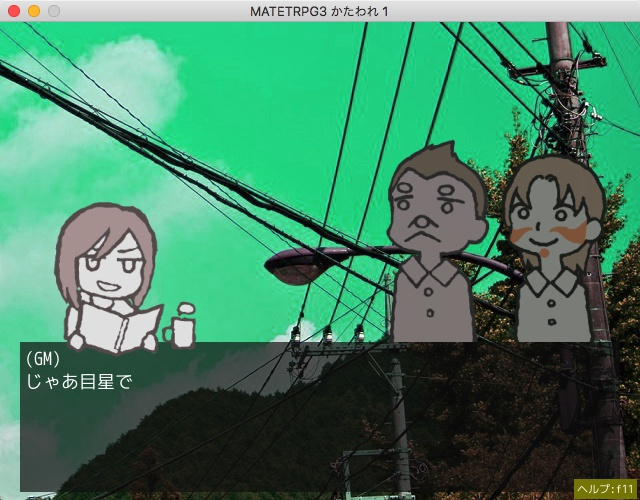
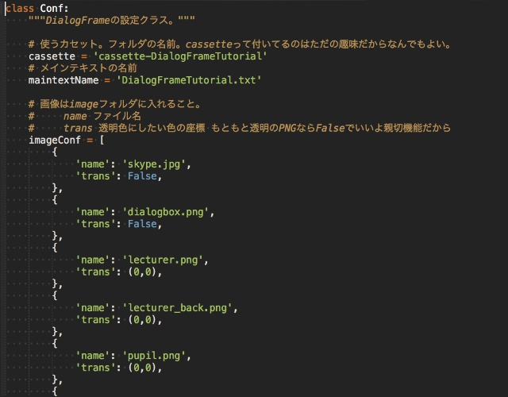

DialogFrame
===

対話劇作成フレームワーク。

## Description

主な機能。

- 台本をざくざく書いてくだけでページ送りに組み込んでくれる。
- 台本にイベントタグを書くことで画像や音楽を呼び出せる。
- 台詞と画像をリンクさせれば、「Aさんが喋ってるときはAさんの画像を表示、黙ってるときは消す、あるいは暗くする」みたいなことが自動で出来る。
- 台本が長くなっちまったら複数に分けて、オープニング画面から分岐させることが出来る。
- オープニング画面のカンタン作成。不使用設定も可能。
- 技能名と技能値を設定しておくと、diceイベントタグでロールアニメ、成功失敗表示とかしてくれる。
- 途中セーブ、ロード可能。不使用設定も可能。
- ページ戻り機能あり。
- 簡単なキーコンフィグあり。
- 画面サイズは640x480固定。
- 台本とか素材はフォルダごとのセットになってるので、セットを入れ替えれば再生する対話劇を変更できる。
- つまりフレームワーク本体がラジカセで、セットがカセットの役割をする。
- エラーが起きたら画面が消えちゃうが、カセットフォルダ内logフォルダにエラーログが残る。

## Usage

[カセット](https://gitlab.com/midori-mate/dialogframe-cassettes)

- カセットフォルダをdataフォルダに放り込む。
- カセットフォルダ内configフォルダから「(...)DialogFrameConfig.py」をコピーする。
- DialogFrame.exeのあるフォルダ(dataフォルダ)にペーストする。
- (...)の部分をとって「DialogFrameConfig.py」に改名する。

Config.pyファイルに「このConfigに対応するカセットを読み込む」って設定が書いてあるんで、これで入れ替えが済んだことになる。なお、チュートリアルはConfigファイルが存在しないとき再生されるようになっている。
